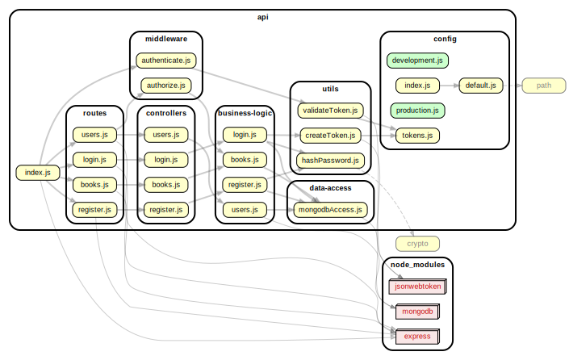

<!-- BEGIN title -->

# API

<!-- END title -->

<!-- BEGIN TREE -->

<!-- END TREE -->

<!-- BEGIN TOC -->

- business-logic
  - [books.js](#apibusiness-logicbooksjs)
  - [googleBooksAPI.js](#apibusiness-logicgoogleBooksAPIjs)
  - [login.js](#apibusiness-logicloginjs)
  - [register.js](#apibusiness-logicregisterjs)
  - [users.js](#apibusiness-logicusersjs)
- config
  - [default.js](#apiconfigdefaultjs)
  - [development.js](#apiconfigdevelopmentjs)
  - [index.js](#apiconfigindexjs)
  - [production.js](#apiconfigproductionjs)
  - [tokens.js](#apiconfigtokensjs)
- controllers
  - [books.js](#apicontrollersbooksjs)
  - [login.js](#apicontrollersloginjs)
  - [register.js](#apicontrollersregisterjs)
  - [users.js](#apicontrollersusersjs)
- data-access
  - [googleBooksAPI.js](#apidata-accessgoogleBooksAPIjs)
  - [mongodbAccess.js](#apidata-accessmongodbAccessjs)
- middleware
  - [authenticate.js](#apimiddlewareauthenticatejs)
  - [authorize.js](#apimiddlewareauthorizejs)
- routes
  - [books.js](#apiroutesbooksjs)
  - [login.js](#apiroutesloginjs)
  - [register.js](#apiroutesregisterjs)
  - [users.js](#apiroutesusersjs)
- utils
  - [createToken.js](#apiutilscreateTokenjs)
  - [hashPassword.js](#apiutilshashPasswordjs)
  - [validateToken.js](#apiutilsvalidateTokenjs)
- [index.js](#apiindexjs)

---

<!-- END TOC -->

---

<!-- BEGIN DOCS -->

# /business-logic

<a href="../../api/business-logic/books.js" id="apibusiness-logicbooksjs">../api/business-logic/books.js</a>

<a href="../../api/business-logic/googleBooksAPI.js" id="apibusiness-logicgoogleBooksAPIjs">../api/business-logic/googleBooksAPI.js</a>

<a href="../../api/business-logic/login.js" id="apibusiness-logicloginjs">../api/business-logic/login.js</a>

<a href="../../api/business-logic/register.js" id="apibusiness-logicregisterjs">../api/business-logic/register.js</a>

<a href="../../api/business-logic/users.js" id="apibusiness-logicusersjs">../api/business-logic/users.js</a>

---

# /config

<a href="../../api/config/default.js" id="apiconfigdefaultjs">../api/config/default.js</a>

<a href="../../api/config/development.js" id="apiconfigdevelopmentjs">../api/config/development.js</a>

<a href="../../api/config/index.js" id="apiconfigindexjs">../api/config/index.js</a>

<a href="../../api/config/production.js" id="apiconfigproductionjs">../api/config/production.js</a>

<a href="../../api/config/tokens.js" id="apiconfigtokensjs">../api/config/tokens.js</a>

---

# /controllers

<a href="../../api/controllers/books.js" id="apicontrollersbooksjs">../api/controllers/books.js</a>

<a href="../../api/controllers/login.js" id="apicontrollersloginjs">../api/controllers/login.js</a>

<a href="../../api/controllers/register.js" id="apicontrollersregisterjs">../api/controllers/register.js</a>

<a href="../../api/controllers/users.js" id="apicontrollersusersjs">../api/controllers/users.js</a>

---

# /data-access

<a href="../../api/data-access/googleBooksAPI.js" id="apidata-accessgoogleBooksAPIjs">../api/data-access/googleBooksAPI.js</a>

<a href="../../api/data-access/mongodbAccess.js" id="apidata-accessmongodbAccessjs">../api/data-access/mongodbAccess.js</a>

---

# /middleware

<a href="../../api/middleware/authenticate.js" id="apimiddlewareauthenticatejs">../api/middleware/authenticate.js</a>

<a href="../../api/middleware/authorize.js" id="apimiddlewareauthorizejs">../api/middleware/authorize.js</a>

---

# /routes

<a href="../../api/routes/books.js" id="apiroutesbooksjs">../api/routes/books.js</a>

<a href="../../api/routes/login.js" id="apiroutesloginjs">../api/routes/login.js</a>

<a href="../../api/routes/register.js" id="apiroutesregisterjs">../api/routes/register.js</a>

<a href="../../api/routes/users.js" id="apiroutesusersjs">../api/routes/users.js</a>

---

# /utils

<a href="../../api/utils/createToken.js" id="apiutilscreateTokenjs">../api/utils/createToken.js</a>

<a href="../../api/utils/hashPassword.js" id="apiutilshashPasswordjs">../api/utils/hashPassword.js</a>

<a href="../../api/utils/validateToken.js" id="apiutilsvalidateTokenjs">../api/utils/validateToken.js</a>

---

<a href="../../api/index.js" id="apiindexjs">../api/index.js</a>

<!-- END DOCS -->
