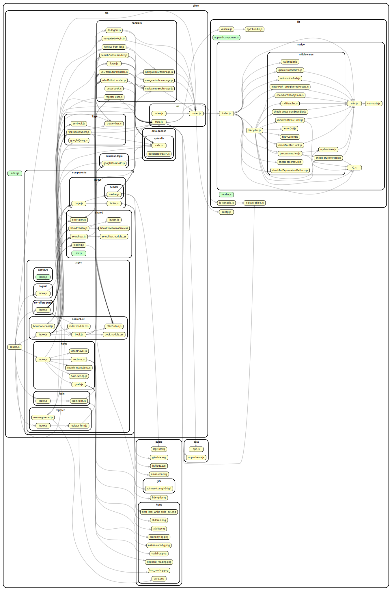

<!-- BEGIN title -->

# CLIENT

<!-- END title -->

<!-- BEGIN TREE -->

<!-- END TREE -->

<!-- BEGIN TOC -->

- data
  - [app.js](#clientdataappjs)
  - [app.schema.js](#clientdataappschemajs)
- lib
  - navigo
    - middlewares
      - [callHandler.js](#clientlibnavigomiddlewarescallHandlerjs)
      - [checkForAfterHook.js](#clientlibnavigomiddlewarescheckForAfterHookjs)
      - [checkForAlreadyHook.js](#clientlibnavigomiddlewarescheckForAlreadyHookjs)
      - [checkForBeforeHook.js](#clientlibnavigomiddlewarescheckForBeforeHookjs)
      - [checkForDeprecationMethods.js](#clientlibnavigomiddlewarescheckForDeprecationMethodsjs)
      - [checkForForceOp.js](#clientlibnavigomiddlewarescheckForForceOpjs)
      - [checkForLeaveHook.js](#clientlibnavigomiddlewarescheckForLeaveHookjs)
      - [checkForNotFoundHandler.js](#clientlibnavigomiddlewarescheckForNotFoundHandlerjs)
      - [errorOut.js](#clientlibnavigomiddlewareserrorOutjs)
      - [flushCurrent.js](#clientlibnavigomiddlewaresflushCurrentjs)
      - [matchPathToRegisteredRoutes.js](#clientlibnavigomiddlewaresmatchPathToRegisteredRoutesjs)
      - [processMatches.js](#clientlibnavigomiddlewaresprocessMatchesjs)
      - [setLocationPath.js](#clientlibnavigomiddlewaressetLocationPathjs)
      - [updateBrowserURL.js](#clientlibnavigomiddlewaresupdateBrowserURLjs)
      - [waitingList.js](#clientlibnavigomiddlewareswaitingListjs)
    - [Q.js](#clientlibnavigoQjs)
    - [constants.js](#clientlibnavigoconstantsjs)
    - [index.js](#clientlibnavigoindexjs)
    - [lifecycles.js](#clientlibnavigolifecyclesjs)
    - [utils.js](#clientlibnavigoutilsjs)
  - [ajv7.bundle.js](#clientlibajv7bundlejs)
  - [append-component.js](#clientlibappend-componentjs)
  - [is-jsonable.js](#clientlibis-jsonablejs)
  - [is-plain-object.js](#clientlibis-plain-objectjs)
  - [render.js](#clientlibrenderjs)
  - [validate.js](#clientlibvalidatejs)
- public
  - gifs
  - icons
- src
  - business-logic
    - [googleBooksAPI.js](#clientsrcbusiness-logicgoogleBooksAPIjs)
  - components
    - layout
      - header
        - [navbar.js](#clientsrccomponentslayoutheadernavbarjs)
      - [footer.js](#clientsrccomponentslayoutfooterjs)
      - [page.js](#clientsrccomponentslayoutpagejs)
    - pages
      - aboutUs
        - [index.js](#clientsrccomponentspagesaboutUsindexjs)
      - home
        - [goals.js](#clientsrccomponentspageshomegoalsjs)
        - [howUseApp.js](#clientsrccomponentspageshomehowUseAppjs)
        - [index.js](#clientsrccomponentspageshomeindexjs)
        - [search-instructions.js](#clientsrccomponentspageshomesearch-instructionsjs)
        - [sections.js](#clientsrccomponentspageshomesectionsjs)
        - [videoPlayer.js](#clientsrccomponentspageshomevideoPlayerjs)
      - login
        - [index.js](#clientsrccomponentspagesloginindexjs)
        - [login-form.js](#clientsrccomponentspagesloginlogin-formjs)
      - logout
        - [index.js](#clientsrccomponentspageslogoutindexjs)
      - my-offers-page
        - [index.js](#clientsrccomponentspagesmy-offers-pageindexjs)
      - register
        - [index.js](#clientsrccomponentspagesregisterindexjs)
        - [register-form.js](#clientsrccomponentspagesregisterregister-formjs)
        - [user-registered.js](#clientsrccomponentspagesregisteruser-registeredjs)
      - searchList
        - [book.js](#clientsrccomponentspagessearchListbookjs)
        - [bookowners-list.js](#clientsrccomponentspagessearchListbookowners-listjs)
        - [index.js](#clientsrccomponentspagessearchListindexjs)
        - [offerButton.js](#clientsrccomponentspagessearchListofferButtonjs)
    - shared
      - [bookPreview.js](#clientsrccomponentssharedbookPreviewjs)
      - [button.js](#clientsrccomponentssharedbuttonjs)
      - [div.js](#clientsrccomponentsshareddivjs)
      - [error-alert.js](#clientsrccomponentssharederror-alertjs)
      - [loading.js](#clientsrccomponentssharedloadingjs)
      - [searchbar.js](#clientsrccomponentssharedsearchbarjs)
  - data-access
    - api-calls
      - [calls.js](#clientsrcdata-accessapi-callscallsjs)
      - [googleBooksAPI.js](#clientsrcdata-accessapi-callsgoogleBooksAPIjs)
  - handlers
    - [do-logout.js](#clientsrchandlersdo-logoutjs)
    - [login.js](#clientsrchandlersloginjs)
    - [navigate-to-homepage.js](#clientsrchandlersnavigate-to-homepagejs)
    - [navigate-to-login.js](#clientsrchandlersnavigate-to-loginjs)
    - [navigateToBooksPage.js](#clientsrchandlersnavigateToBooksPagejs)
    - [navigateToOffersPage.js](#clientsrchandlersnavigateToOffersPagejs)
    - [offerButtonHandler.js](#clientsrchandlersofferButtonHandlerjs)
    - [register-user.js](#clientsrchandlersregister-userjs)
    - [remove-from-list.js](#clientsrchandlersremove-from-listjs)
    - [searchButtonHandler.js](#clientsrchandlerssearchButtonHandlerjs)
    - [unOfferButtonHandler.js](#clientsrchandlersunOfferButtonHandlerjs)
    - [unset-book.js](#clientsrchandlersunset-bookjs)
  - init
    - [index.js](#clientsrcinitindexjs)
    - [router.js](#clientsrcinitrouterjs)
    - [state.js](#clientsrcinitstatejs)
  - logic
    - [createFilter.js](#clientsrclogiccreateFilterjs)
    - [find-bookowners.js](#clientsrclogicfind-bookownersjs)
    - [googleQuery.js](#clientsrclogicgoogleQueryjs)
    - [set-book.js](#clientsrclogicset-bookjs)
  - [index.js](#clientsrcindexjs)
  - [routes.js](#clientsrcroutesjs)
- styles
- [config.js](#clientconfigjs)

---

<!-- END TOC -->

---

<!-- BEGIN DOCS -->

# /data

<a href="../../client/data/app.js" id="clientdataappjs">../client/data/app.js</a>

<a href="../../client/data/app.schema.js" id="clientdataappschemajs">../client/data/app.schema.js</a>

---

# /lib

## /navigo

### /middlewares

<a href="../../client/lib/navigo/middlewares/callHandler.js" id="clientlibnavigomiddlewarescallHandlerjs">../client/lib/navigo/middlewares/callHandler.js</a>

<a href="../../client/lib/navigo/middlewares/checkForAfterHook.js" id="clientlibnavigomiddlewarescheckForAfterHookjs">../client/lib/navigo/middlewares/checkForAfterHook.js</a>

<a href="../../client/lib/navigo/middlewares/checkForAlreadyHook.js" id="clientlibnavigomiddlewarescheckForAlreadyHookjs">../client/lib/navigo/middlewares/checkForAlreadyHook.js</a>

<a href="../../client/lib/navigo/middlewares/checkForBeforeHook.js" id="clientlibnavigomiddlewarescheckForBeforeHookjs">../client/lib/navigo/middlewares/checkForBeforeHook.js</a>

<a href="../../client/lib/navigo/middlewares/checkForDeprecationMethods.js" id="clientlibnavigomiddlewarescheckForDeprecationMethodsjs">../client/lib/navigo/middlewares/checkForDeprecationMethods.js</a>

<a href="../../client/lib/navigo/middlewares/checkForForceOp.js" id="clientlibnavigomiddlewarescheckForForceOpjs">../client/lib/navigo/middlewares/checkForForceOp.js</a>

<a href="../../client/lib/navigo/middlewares/checkForLeaveHook.js" id="clientlibnavigomiddlewarescheckForLeaveHookjs">../client/lib/navigo/middlewares/checkForLeaveHook.js</a>

<a href="../../client/lib/navigo/middlewares/checkForNotFoundHandler.js" id="clientlibnavigomiddlewarescheckForNotFoundHandlerjs">../client/lib/navigo/middlewares/checkForNotFoundHandler.js</a>

<a href="../../client/lib/navigo/middlewares/errorOut.js" id="clientlibnavigomiddlewareserrorOutjs">../client/lib/navigo/middlewares/errorOut.js</a>

<a href="../../client/lib/navigo/middlewares/flushCurrent.js" id="clientlibnavigomiddlewaresflushCurrentjs">../client/lib/navigo/middlewares/flushCurrent.js</a>

<a href="../../client/lib/navigo/middlewares/matchPathToRegisteredRoutes.js" id="clientlibnavigomiddlewaresmatchPathToRegisteredRoutesjs">../client/lib/navigo/middlewares/matchPathToRegisteredRoutes.js</a>

<a href="../../client/lib/navigo/middlewares/processMatches.js" id="clientlibnavigomiddlewaresprocessMatchesjs">../client/lib/navigo/middlewares/processMatches.js</a>

<a href="../../client/lib/navigo/middlewares/setLocationPath.js" id="clientlibnavigomiddlewaressetLocationPathjs">../client/lib/navigo/middlewares/setLocationPath.js</a>

<a href="../../client/lib/navigo/middlewares/updateBrowserURL.js" id="clientlibnavigomiddlewaresupdateBrowserURLjs">../client/lib/navigo/middlewares/updateBrowserURL.js</a>

<a href="../../client/lib/navigo/middlewares/waitingList.js" id="clientlibnavigomiddlewareswaitingListjs">../client/lib/navigo/middlewares/waitingList.js</a>

---

<a href="../../client/lib/navigo/Q.js" id="clientlibnavigoQjs">../client/lib/navigo/Q.js</a>

<a href="../../client/lib/navigo/constants.js" id="clientlibnavigoconstantsjs">../client/lib/navigo/constants.js</a>

<a href="../../client/lib/navigo/index.js" id="clientlibnavigoindexjs">../client/lib/navigo/index.js</a>

<a href="../../client/lib/navigo/lifecycles.js" id="clientlibnavigolifecyclesjs">../client/lib/navigo/lifecycles.js</a>

<a href="../../client/lib/navigo/utils.js" id="clientlibnavigoutilsjs">../client/lib/navigo/utils.js</a>

---

<a href="../../client/lib/ajv7.bundle.js" id="clientlibajv7bundlejs">../client/lib/ajv7.bundle.js</a>

<a href="../../client/lib/append-component.js" id="clientlibappend-componentjs">../client/lib/append-component.js</a>

<a href="../../client/lib/is-jsonable.js" id="clientlibis-jsonablejs">../client/lib/is-jsonable.js</a>

<a href="../../client/lib/is-plain-object.js" id="clientlibis-plain-objectjs">../client/lib/is-plain-object.js</a>

<a href="../../client/lib/render.js" id="clientlibrenderjs">../client/lib/render.js</a>

## render

Renders a string of HTML.

<a href="../../client/lib/validate.js" id="clientlibvalidatejs">../client/lib/validate.js</a>

---

# /public

## /gifs

---

## /icons

---

---

# /src

## /business-logic

<a href="../../client/src/business-logic/googleBooksAPI.js" id="clientsrcbusiness-logicgoogleBooksAPIjs">../client/src/business-logic/googleBooksAPI.js</a>

---

## /components

### /layout

#### /header

<a href="../../client/src/components/layout/header/navbar.js" id="clientsrccomponentslayoutheadernavbarjs">../client/src/components/layout/header/navbar.js</a>

## navbar ⇒ <code>HTMLDivElement</code>

The shared navbar.

**Returns**: <code>HTMLDivElement</code> - A rendered nav bar element.

| Param  | Type                | Description                          |
| ------ | ------------------- | ------------------------------------ |
| routes | <code>object</code> | A routes object, see /src/routes.js. |

---

<a href="../../client/src/components/layout/footer.js" id="clientsrccomponentslayoutfooterjs">../client/src/components/layout/footer.js</a>

## footer ⇒ <code>HTMLDivElement</code>

The shared footer.

**Returns**: <code>HTMLDivElement</code> - A rendered footer element.

<a href="../../client/src/components/layout/page.js" id="clientsrccomponentslayoutpagejs">../client/src/components/layout/page.js</a>

## page ⇒ <code>HTMLDivElement</code>

The page layout component.

**Returns**: <code>HTMLDivElement</code> - A rendered page element.  
**Throws**:

- <code>TypeError</code> When the bodyComponent is not a function or DOM element.

| Param         | Type                                              | Description                               |
| ------------- | ------------------------------------------------- | ----------------------------------------- |
| bodyComponent | <code>function</code> \| <code>HTMLElement</code> | The body for the newly rendered page.     |
| routes        | <code>object</code>                               | The application's routes, for the navbar. |

---

### /pages

#### /aboutUs

<a href="../../client/src/components/pages/aboutUs/index.js" id="clientsrccomponentspagesaboutUsindexjs">../client/src/components/pages/aboutUs/index.js</a>

## about ⇒ <code>HTMLDivElement</code>

The register page. Loads when the register page is requested.

**Returns**: <code>HTMLDivElement</code> - A rendered register page.

---

#### /home

<a href="../../client/src/components/pages/home/goals.js" id="clientsrccomponentspageshomegoalsjs">../client/src/components/pages/home/goals.js</a>

<a href="../../client/src/components/pages/home/howUseApp.js" id="clientsrccomponentspageshomehowUseAppjs">../client/src/components/pages/home/howUseApp.js</a>

<a href="../../client/src/components/pages/home/index.js" id="clientsrccomponentspageshomeindexjs">../client/src/components/pages/home/index.js</a>

<a href="../../client/src/components/pages/home/search-instructions.js" id="clientsrccomponentspageshomesearch-instructionsjs">../client/src/components/pages/home/search-instructions.js</a>

<a href="../../client/src/components/pages/home/sections.js" id="clientsrccomponentspageshomesectionsjs">../client/src/components/pages/home/sections.js</a>

<a href="../../client/src/components/pages/home/videoPlayer.js" id="clientsrccomponentspageshomevideoPlayerjs">../client/src/components/pages/home/videoPlayer.js</a>

---

#### /login

<a href="../../client/src/components/pages/login/index.js" id="clientsrccomponentspagesloginindexjs">../client/src/components/pages/login/index.js</a>

## login ⇒ <code>HTMLDivElement</code>

The login page.

**Returns**: <code>HTMLDivElement</code> - A rendered login page.

<a href="../../client/src/components/pages/login/login-form.js" id="clientsrccomponentspagesloginlogin-formjs">../client/src/components/pages/login/login-form.js</a>

## loginForm ⇒ <code>object</code>

This component creates a login form inside a div.

**Returns**: <code>object</code> - - A div element.

---

#### /logout

<a href="../../client/src/components/pages/logout/index.js" id="clientsrccomponentspageslogoutindexjs">../client/src/components/pages/logout/index.js</a>

## logout ⇒ <code>HTMLDivElement</code>

The logout page.

**Returns**: <code>HTMLDivElement</code> - A rendered logout page.

---

#### /my-offers-page

<a href="../../client/src/components/pages/my-offers-page/index.js" id="clientsrccomponentspagesmy-offers-pageindexjs">../client/src/components/pages/my-offers-page/index.js</a>

## myOffers ⇒ <code>HTMLDivElement</code>

The Books search result page.

**Returns**: <code>HTMLDivElement</code> - A rendered search result page.

---

#### /register

<a href="../../client/src/components/pages/register/index.js" id="clientsrccomponentspagesregisterindexjs">../client/src/components/pages/register/index.js</a>

## register ⇒ <code>HTMLDivElement</code>

The register page. Loads when the register page is requested.

**Returns**: <code>HTMLDivElement</code> - A rendered register page.

<a href="../../client/src/components/pages/register/register-form.js" id="clientsrccomponentspagesregisterregister-formjs">../client/src/components/pages/register/register-form.js</a>

## registerForm ⇒ <code>object</code>

This component creates a registration form inside a div.

**Returns**: <code>object</code> - - A div element.

<a href="../../client/src/components/pages/register/user-registered.js" id="clientsrccomponentspagesregisteruser-registeredjs">../client/src/components/pages/register/user-registered.js</a>

---

#### /searchList

<a href="../../client/src/components/pages/searchList/book.js" id="clientsrccomponentspagessearchListbookjs">../client/src/components/pages/searchList/book.js</a>

## bookDetail ⇒ <code>HTMLDivElement</code>

The book card.

**Returns**: <code>HTMLDivElement</code> - A rendered book page.

<a href="../../client/src/components/pages/searchList/bookowners-list.js" id="clientsrccomponentspagessearchListbookowners-listjs">../client/src/components/pages/searchList/bookowners-list.js</a>

<a href="../../client/src/components/pages/searchList/index.js" id="clientsrccomponentspagessearchListindexjs">../client/src/components/pages/searchList/index.js</a>

## searchList ⇒ <code>HTMLDivElement</code>

The Books search result page.

**Returns**: <code>HTMLDivElement</code> - A rendered search result page.

<a href="../../client/src/components/pages/searchList/offerButton.js" id="clientsrccomponentspagessearchListofferButtonjs">../client/src/components/pages/searchList/offerButton.js</a>

---

---

### /shared

<a href="../../client/src/components/shared/bookPreview.js" id="clientsrccomponentssharedbookPreviewjs">../client/src/components/shared/bookPreview.js</a>

<a href="../../client/src/components/shared/button.js" id="clientsrccomponentssharedbuttonjs">../client/src/components/shared/button.js</a>

<a href="../../client/src/components/shared/div.js" id="clientsrccomponentsshareddivjs">../client/src/components/shared/div.js</a>

## divElement ⇒ <code>object</code>

This component creates a div element and returns it.

**Returns**: <code>object</code> - - A div element.

| Param      | Type                | Description                         |
| ---------- | ------------------- | ----------------------------------- |
| classNames | <code>string</code> | The class names of the div element. |
| id         | <code>string</code> | The unique id of the div element.   |

<a href="../../client/src/components/shared/error-alert.js" id="clientsrccomponentssharederror-alertjs">../client/src/components/shared/error-alert.js</a>

<a href="../../client/src/components/shared/loading.js" id="clientsrccomponentssharedloadingjs">../client/src/components/shared/loading.js</a>

<a href="../../client/src/components/shared/searchbar.js" id="clientsrccomponentssharedsearchbarjs">../client/src/components/shared/searchbar.js</a>

---

---

## /data-access

### /api-calls

<a href="../../client/src/data-access/api-calls/calls.js" id="clientsrcdata-accessapi-callscallsjs">../client/src/data-access/api-calls/calls.js</a>

<a href="../../client/src/data-access/api-calls/googleBooksAPI.js" id="clientsrcdata-accessapi-callsgoogleBooksAPIjs">../client/src/data-access/api-calls/googleBooksAPI.js</a>

---

---

## /handlers

<a href="../../client/src/handlers/do-logout.js" id="clientsrchandlersdo-logoutjs">../client/src/handlers/do-logout.js</a>

<a href="../../client/src/handlers/login.js" id="clientsrchandlersloginjs">../client/src/handlers/login.js</a>

## logIn

This function validated user input and submits the data to the database.

| Param | Type               | Description                     |
| ----- | ------------------ | ------------------------------- |
| event | <code>event</code> | Click on the button "register". |

<a href="../../client/src/handlers/navigate-to-homepage.js" id="clientsrchandlersnavigate-to-homepagejs">../client/src/handlers/navigate-to-homepage.js</a>

<a href="../../client/src/handlers/navigate-to-login.js" id="clientsrchandlersnavigate-to-loginjs">../client/src/handlers/navigate-to-login.js</a>

<a href="../../client/src/handlers/navigateToBooksPage.js" id="clientsrchandlersnavigateToBooksPagejs">../client/src/handlers/navigateToBooksPage.js</a>

<a href="../../client/src/handlers/navigateToOffersPage.js" id="clientsrchandlersnavigateToOffersPagejs">../client/src/handlers/navigateToOffersPage.js</a>

<a href="../../client/src/handlers/offerButtonHandler.js" id="clientsrchandlersofferButtonHandlerjs">../client/src/handlers/offerButtonHandler.js</a>

<a href="../../client/src/handlers/register-user.js" id="clientsrchandlersregister-userjs">../client/src/handlers/register-user.js</a>

## registerUser

This function validated user input and submits the data to the database.

| Param | Type               | Description                     |
| ----- | ------------------ | ------------------------------- |
| event | <code>event</code> | Click on the button "register". |

<a href="../../client/src/handlers/remove-from-list.js" id="clientsrchandlersremove-from-listjs">../client/src/handlers/remove-from-list.js</a>

<a href="../../client/src/handlers/searchButtonHandler.js" id="clientsrchandlerssearchButtonHandlerjs">../client/src/handlers/searchButtonHandler.js</a>

<a href="../../client/src/handlers/unOfferButtonHandler.js" id="clientsrchandlersunOfferButtonHandlerjs">../client/src/handlers/unOfferButtonHandler.js</a>

<a href="../../client/src/handlers/unset-book.js" id="clientsrchandlersunset-bookjs">../client/src/handlers/unset-book.js</a>

---

## /init

<a href="../../client/src/init/index.js" id="clientsrcinitindexjs">../client/src/init/index.js</a>

<a href="../../client/src/init/router.js" id="clientsrcinitrouterjs">../client/src/init/router.js</a>

<a href="../../client/src/init/state.js" id="clientsrcinitstatejs">../client/src/init/state.js</a>

---

## /logic

<a href="../../client/src/logic/createFilter.js" id="clientsrclogiccreateFilterjs">../client/src/logic/createFilter.js</a>

<a href="../../client/src/logic/find-bookowners.js" id="clientsrclogicfind-bookownersjs">../client/src/logic/find-bookowners.js</a>

<a href="../../client/src/logic/googleQuery.js" id="clientsrclogicgoogleQueryjs">../client/src/logic/googleQuery.js</a>

<a href="../../client/src/logic/set-book.js" id="clientsrclogicset-bookjs">../client/src/logic/set-book.js</a>

---

<a href="../../client/src/index.js" id="clientsrcindexjs">../client/src/index.js</a>

<a href="../../client/src/routes.js" id="clientsrcroutesjs">../client/src/routes.js</a>

## routes

Defines the route URLs, names and callbacks.

---

# /styles

---

<a href="../../client/config.js" id="clientconfigjs">../client/config.js</a>

<!-- END DOCS -->
